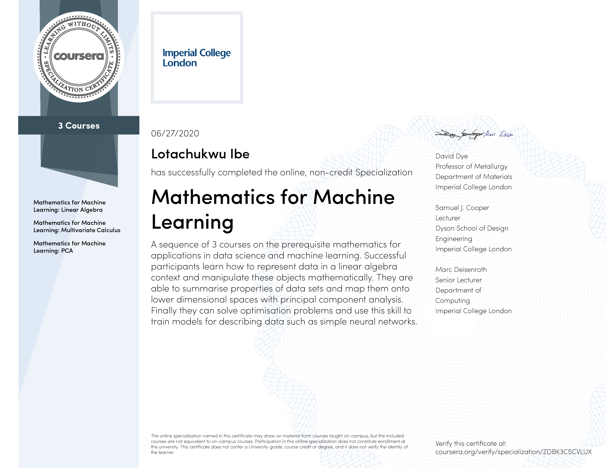

# Certificates
MOOC's completed on Codecademy and Coursera

## See preview below

| <a href="https://github.com/LotaIbe/Certificates/blob/master/Lotachukwu%20Ibe%20_%20Codecademy.pdf">                                                                                                              | <a href="https://github.com/LotaIbe/Certificates/blob/master/Specialization%20Certificates/Architecting%20with%20Google%20Compute%20Engine.pdf">  |
|----------------------------------------------------------------------------------------------------------------------------------------------------------------------------------------------------------------------------------------------------------------------------------------------------------------------------------------------|-----------------------------------------------------------------------------------------------------------------------------------------------------------------------------------------------------------------------------------------------------------------------------------------------------------|
| <a href="https://github.com/LotaIbe/Certificates/blob/master/Specialization%20Certificates/Java%20Programming%20and%20Software%20Engineering%20Fundamentals.pdf">   | <a href="https://github.com/LotaIbe/Certificates/blob/master/Specialization%20Certificates/Mathematics%20for%20Machine%20Learning.pdf">                  |
| <a href="https://github.com/LotaIbe/Certificates/blob/master/Specialization%20Certificates/Modern%20Big%20Data%20Analysis%20with%20SQL.pdf">                                            | <a href="https://github.com/LotaIbe/Certificates/blob/master/Specialization%20Certificates/Modern%20Big%20Data%20Analysis%20with%20SQL.pdf">         |
 
